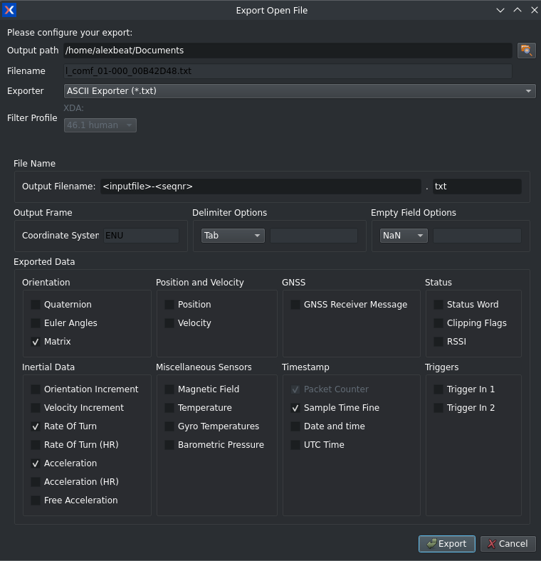

# opensim-core-examples

## Examples

## IMUXsense

1. Uses data from the [Kuopio Gait Dataset](https://zenodo.org/records/10559504)
2. Download [MTI Manager](https://www.movella.com/support/software-documentation) and install. Use the extra steps for [Linux](https://base.movella.com/s/article/MT-Manager-Installation-Guide-for-ubuntu-20-04-and-22-04?language=en_US) if needed.
3. Load an `.mtb` file representing a trial into MTI manager.
4. Export from MTI Manager using the following settings 


> NOTE: Data collected at 100 Hz

## Minimal Bug Reproduction

### Triangle Inequality
For reproducing this error:
> what():  SimTK Exception thrown at MassProperties.h:542:
  Error detected by Simbody method Inertia::operator-=(): Diagonals of an Inertia matrix must satisfy the triangle inequality; got 0.000105365,0.00021073,0.00105365.
  (Required condition 'Ixx+Iyy+Slop>=Izz && Ixx+Izz+Slop>=Iyy && Iyy+Izz+Slop>=Ixx' was not met.)

 use `IMUIKTriangleInequality` example and build opensim-core. Tested with and without python or java bindings and it didn't make a difference

### Locale IO Problem
For reproducing this error:
>  what():  Timestamp at row 0 with value 0,000000 is greater-than/equal to timestamp at row 1 with value 0,000000
        Thrown at TimeSeriesTable.h:533 in validateRow().

 use the `IMUIKLocaleProblem` example 


## Build Instructions
1. Make sure you have opensim-core installed and on path


2. Change to example project directory

```
cmake -B build .
```
3. 
```
cd build
make
```

### Code Reference

```cpp
// How to get a body from a model
const OpenSim::Body& body = model.getBodySet().get("pelvis");
```

### Running Bulk scripts


Preprocessing
```sh
./main ~/Downloads/kuopio-gait-dataset ~/data/kuopio-gait-dataset
7z a -mmt=on ~/data/kuopio-gait-dataset-processed-v2.zip ~/data/kuopio-gait-dataset/*
7z a -mmt=on ~/data/kuopio-gait-dataset-processed-01-25-v2.zip ~/data/kuopio-gait-dataset-processed-01-25/*
7z a -mmt=on ~/data/kuopio-gait-dataset-processed-26-51-v2.zip ~/data/kuopio-gait-dataset-processed-26-51/*
```

Scale Tool:
```sh
./main ~/data/kuopio-gait-dataset-processed-v2 ~/data/kuopio-gait-dataset-processed-v2-models

7z a -mmt=on ~/data/kuopio-gait-dataset-models-v3.zip ~/data/kuopio-gait-dataset-processed-v2-models/*
7z a -mmt=on ~/data/kuopio-gait-dataset-models-v3-r_comf_01.zip ~/data/kuopio-gait-dataset-processed-v2-models-r_comf_01/*

```

MarkerIKBulk Tool:
```sh
./main ~/data/kuopio-gait-dataset-processed-v2 ~/data/kuopio-gait-dataset-processed-v2-models ~/data/kuopio-gait-dataset-processed-v2-marker-ik-results-v5

7z a -mmt=on ~/data/kuopio-gait-dataset-marker-ik-results.zip ~/data/kuopio-gait-dataset-processed-v2-ik-results/*
```

IMUIKBulk and IMUPlacerBulk Tool:
Run IMUPlacerBulk first and then IMUIKBulk with same command
```sh
./main ~/data/kuopio-gait-dataset-processed-v2 ~/data/kuopio-gait-dataset-processed-v2-models ~/data/kuopio-gait-dataset-processed-v2-imu-ik-results-v2

7z a -mmt=on ~/data/kuopio-gait-dataset-marker-ik-results.zip ~/data/kuopio-gait-dataset-processed-v2-ik-results/*
```
### Running OpenSim
```sh
~/opensim-workspace/opensim-gui-source/Gui/opensim/dist/installer/opensim/bin/opensim --jdkhome /usr/lib/jvm/default
```

## On Server

 cmake -B build -DOpenSim_DIR="~/opensim-core/cmake"

 IMUIKBulk and IMUPlacerBulk:
 ./main ~/data/kuopio-gait-dataset-processed-v2 ~/data/kuopio-gait-dataset-processed-v2-models ~/data/kuopio-gait-dataset-processed-v2-imu-ik-results
 ./main ~/data/kuopio-gait-dataset-processed-v2 ~/data/kuopio-gait-dataset-processed-v2-models ~/data/hamariina-results/kg-imu-ik-results
 ./main ~/data/kuopio-gait-dataset-processed-v2 ~/data/kuopio-gait-dataset-processed-v2-models ~/data/test-imu-ik-results